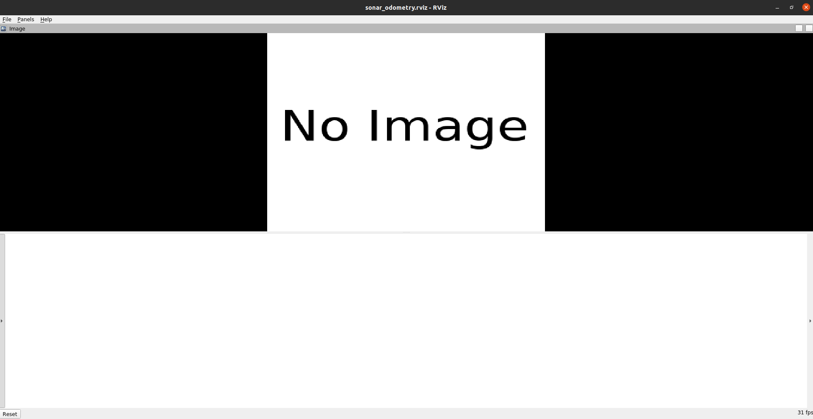

# DISO: Direct Imaging Sonar Odometry


Welcome to the **Direct Imaging Sonar Odometry (DISO)** system repository!

DISO is an advanced sonar odometry framework developed to enhance the accuracy and reliability of underwater navigation. It estimates the relative transformation between two sonar frames by minimizing aggregated sonar intensity errors at points with high intensity gradients. Key features include:
- **Diect Sonar Optimization**: Optimizes transformations between two sonar frames by minizing the overall acoustic intensity error.
- **Multi-sensor Window Optimization**: Optimizes transformations across multiple frames for robust trajectory estimation.
- **Data Association Strategy**: Efficiently matches corresponding sonar points to enhance accuracy.
- **Acoustic Intensity Outlier Rejection**: Filters out anomalous sonar readings for improved reliability.

## Linux Installation

This is the **ROS 2** version of DISO. It has been tested on **Ubuntu 26.04** with
**ROS 2 Lyrical** (`rmw_zenoh_cpp`), OpenCV 4.10, PCL 1.15 and g2o 2020.5.29.
The original ROS 1 (Noetic / catkin) version is in the repository history.

### Dependencies

Everything is packaged; nothing needs to be built from source.

```bash
sudo apt install \
    ros-$ROS_DISTRO-libg2o \
    ros-$ROS_DISTRO-sophus \
    ros-$ROS_DISTRO-cv-bridge \
    ros-$ROS_DISTRO-image-transport \
    ros-$ROS_DISTRO-image-transport-plugins \
    ros-$ROS_DISTRO-message-filters \
    ros-$ROS_DISTRO-pcl-conversions \
    ros-$ROS_DISTRO-tf2-ros \
    ros-$ROS_DISTRO-rosbag2-storage-mcap \
    libeigen3-dev libopencv-dev libpcl-dev libjsoncpp-dev
```

(`libjsoncpp-dev` is needed because Ubuntu 26.04's VTK 9.5 CMake targets, pulled in
through PCL, reference `JsonCpp::JsonCpp`.)

### Build

```bash
mkdir -p diso_ws/src
cd diso_ws/src
git clone https://github.com/SenseRoboticsLab/DISO.git
cd ..
colcon build --symlink-install
source install/setup.bash
```

A `docker/` recipe is also provided:

```bash
cd DISO/docker
xhost +
DISO_BAG_DIR=/path/to/bags docker compose up
```

### Dataset Preparation
Thanks the authors of [Aracati2017](https://github.com/matheusbg8/aracati2017) dataset for releasing their data.

Download the bag from the
[Aracati2017 google drive](https://drive.google.com/file/d/1dbpfd3jElTdHmnceKE5RL8hzU-BDYaW-/view?usp=sharing)
and convert it to a rosbag2 recording, e.g. with
[`rosbags-convert`](https://ternaris.gitlab.io/rosbags/):

```bash
pip install rosbags
rosbags-convert --src ARACATI_2017_8bits_full.bag --dst aracati2017 --dst-storage mcap
```

The resulting bag provides `/son/compressed`, `/pose_gt` and `/cmd_vel`.

### Run

```bash
ros2 launch direct_sonar_odometry aracati2017.launch.py \
    bag:=/path/to/aracati2017 \
    use_sim_time:=true \
    output_dir:=$HOME/diso_results
```



Launch arguments:

| argument | default | meaning |
| --- | --- | --- |
| `config` | `config/config_aracati2017.yaml` | DISO settings file (OpenCV `FileStorage` format) |
| `bag` | *(empty)* | rosbag2 directory to play; empty plays nothing |
| `bag_args` | `--clock -r 0.8` | extra arguments for `ros2 bag play` |
| `use_sim_time` | `false` | follow the bag's `/clock` |
| `output_dir` | *(empty)* | where `stamped_traj_estimate.txt` / `stamped_groundtruth_gt.txt` are written; empty disables them |
| `debug_dir` | *(empty)* | per-edge chi2 dumps and debug images; empty disables them |
| `rviz` | `true` | start RViz2 with `launch/sonar_odometry.rviz` |
| `odom_source` | `cmd_vel` | `cmd_vel` runs the bundled dead-reckoning node to produce `/odom_pose`; `external` expects you to publish it |

#### The odometry prior

DISO fuses the sonar with an odometry prior read from `OdomTopic` in the settings
file (`/odom_pose` for aracati2017). The Aracati2017 bag does not contain that
topic — upstream it was produced by the `odom` node of the companion
[Aracati2017_DISO](https://github.com/SenseRoboticsLab/Aracati2017_DISO) package,
which dead-reckons the `/cmd_vel` body velocities. So that the bag can be used on
its own, this repository ships an equivalent node (`cmd_vel_odom`,
[`src/CmdVelOdom.cpp`](src/CmdVelOdom.cpp)), started by the launch file by
default. Set `odom_source:=external` to turn it off, or point `OdomTopic` at
`/pose_gt` to run against ground truth instead.

### Nodes and topics

| node | role |
| --- | --- |
| `aracati2017_node` / `direct_sonar_odometry_node` | DISO itself; takes the settings file as `argv[1]` or as the `settings_file` parameter |
| `cmd_vel_odom` | dead-reckoned `/odom_pose` prior (see above) |
| `repub_gt` | re-references `/pose_gt` to its first sample and republishes it under `/gt_repub/*` |
| `traj_align` | offline SE(3) trajectory alignment / marker visualisation |

DISO publishes `/direct_sonar/pose`, `/direct_sonar/path`, `/direct_sonar/odom`,
`/direct_sonar/odom_path`, `/direct_sonar/image`, `/direct_sonar/point_cloud`,
`/direct_sonar/visualization_marker`, and the `odom -> base_link` transform. It
offers the `/direct_sonar/save_map` service (`std_srvs/srv/Empty`).

## Notes on the ROS 2 port

The tracking, data association, outlier rejection and window optimisation are
unchanged; only the middleware layer was rewritten. Things worth knowing:

* **Build system** — catkin → `ament_cmake`; `package.xml` is now format 3.
* **Vendored `cv_bridge` removed** — `include/cv_bridge_slam/` and
  `src/cv_bridge.cpp` were a copy of ROS 1's `cv_bridge`. ROS 2 ships its own, so
  the copy is gone and the code includes `<cv_bridge/cv_bridge.hpp>`.
* **`fmt` dropped** — it was linked but never used.
* **g2o** — the packaged g2o takes `std::unique_ptr` solvers, so every
  `new BlockSolver(linearSolver)` became
  `std::make_unique<BlockSolver>(std::move(linearSolver))`.
* **Node structure** — `System` is now an `rclcpp::Node`; `Track` and
  `LocalMapping` receive a `rclcpp::Node*` so they can create their publishers.
* **Clean shutdown** — the local-mapping thread used to be a bare `while(1)`. It
  now stops on `RequestStop()` / `rclcpp::ok()` and is joined by `~System()`,
  which also flushes the trajectory files.
* **No more hardcoded paths** — the original wrote to absolute paths under
  `/home/da/project/ros/...`, which silently did nothing. Trajectory dumps now go
  to the `output_dir` parameter and debug dumps to `debug_dir`; both are disabled
  when empty. The trajectory files are rewritten every 100 frames instead of every
  frame (the original rewrote the whole file each time, which is quadratic) and
  once more at shutdown, so the final contents are the same.
* **Launch and RViz** — the XML launch files became `*.launch.py`, and the four
  RViz1 configs were rewritten for RViz2. An identity `map -> odom` static
  transform was added because DISO publishes in both frames.
* **`bruce.launch.py` / `sim.launch.py`** are ported for completeness but were
  already incomplete upstream: they referenced a `direct_sonar_odometry_node2`
  target, a `sim_node` target and a `bruce_save.py` script that do not exist in
  this repository. See the header comments in those files.
* **Fixed while porting** — `LocalMapping`'s two-argument constructor never
  assigned `mpTracker`.

## Paper
For more information, please read our [paper](https://ieeexplore.ieee.org/document/10611064)

## Citation
```
@INPROCEEDINGS{10611064,
  author={Xu, Shida and Zhang, Kaicheng and Hong, Ziyang and Liu, Yuanchang and Wang, Sen},
  booktitle={2024 IEEE International Conference on Robotics and Automation (ICRA)}, 
  title={DISO: Direct Imaging Sonar Odometry}, 
  year={2024},
  pages={8573-8579},
  doi={10.1109/ICRA57147.2024.10611064}}

```

## License

DISO is released under a GPLv3 license. For commercial purposes of DISO , please contact: sen.wang@imperial.ac.uk